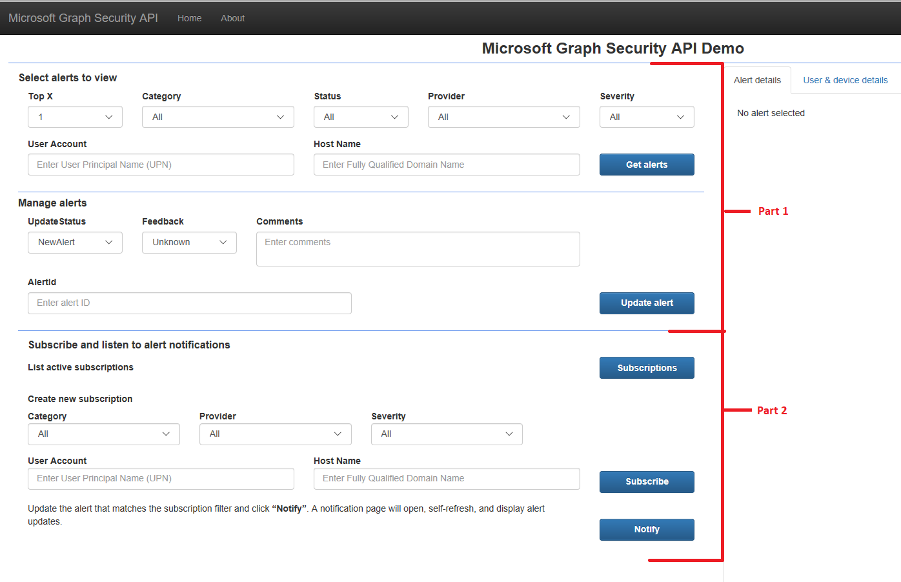
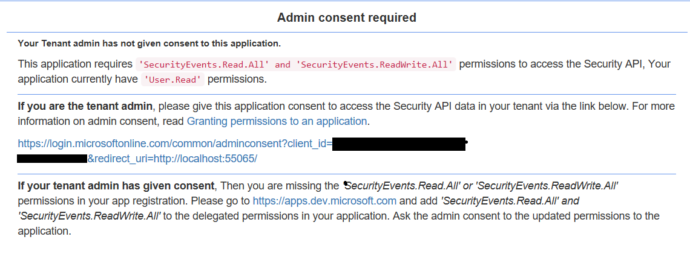
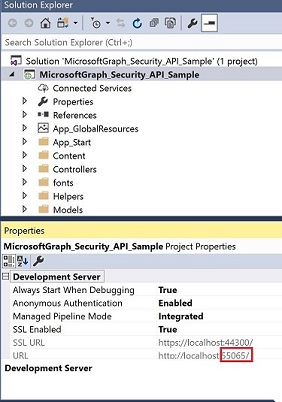
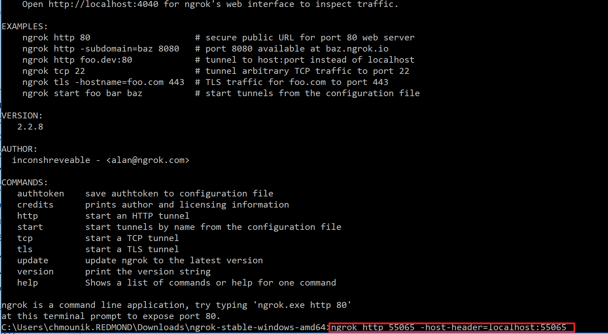
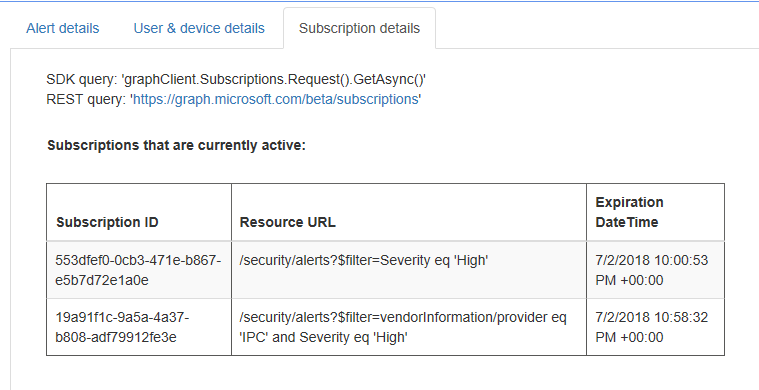
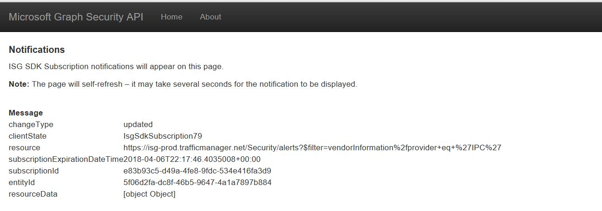

# Microsoft Graph Security API Sample for ASP.NET 4.6 (REST)

## Table of contents

* [Introduction](#introduction)
* [Prerequisites](#prerequisites)
* [Register the application](#register-the-application)
* [Grant Admin consent to view Security data](#grant-admin-consent-to-view-security-data)
* [Build and run the sample](#build-and-run-the-sample)
* [Deploy the sample to Azure](#deploy-the-sample-to-azure)
* [Code of note](#code-of-note)
* [Questions and comments](#questions-and-comments)
* [Contributing](#contributing)
* [Additional resources](#additional-resources)

## Introduction

This sample shows how to connect an ASP.NET 4.6 MVC web app using a Microsoft work or school (Azure Active Directory) account to the Microsoft Graph security API to retrieve security Alerts, Update an Alert, Subscribe to Alert notifications and also a sample listener for Alert notifications. It uses REST calls to interact with the Microsoft Graph API.

The sample uses the [Microsoft Authentication Library (MSAL)](https://www.nuget.org/packages/Microsoft.Identity.Client/) for authentication. The MSAL SDK provides features for working with the [Azure AD v2.0 endpoint](https://azure.microsoft.com/en-us/documentation/articles/active-directory-appmodel-v2-overview) that enables developers to write a single code flow that handles authentication for both work or school (Azure Active Directory) accounts.

## Important Note about the MSAL Preview

This preview library is suitable for use in a production environment. We provide the same production level support for this library as we do our current production libraries. During the preview we may make changes to the API, internal cache format, and other mechanisms of this library, which you will be required to incorporate along with bug fixes and/or feature improvements. This may impact your applications, for example, a change to the cache format may impact your users, by requiring them to sign in again. An API change may require you to update your code. When we provide the General Availability release we will require you to update to the General Availability version within six months, as applications written using a preview version of library may no longer work.

## Prerequisites

This sample requires the following:  

  * [Visual Studio 2015 or higher](https://www.visualstudio.com/en-us/downloads) 
  * [Microsoft work or school account](https://www.outlook.com) 

## Getting started with sample

 1. Download or clone the Microsoft Graph Security API Sample for ASP.NET 4.6 (REST).

 2. The sample consists of two parts as shown in the picture below.

  Part 1 : **Get alerts and Manage alert**

  Part 2 :  **Subscribe and listen to the notifications**

## Register the application

1. Sign into the [Application Registration Portal](https://apps.dev.microsoft.com/) using either your work or school account.

2. Choose **Add an app**.

3. Enter a name for the application, and choose **Create application**. 
	
   The registration page displays the properties of your app.

4. Copy the Application Id. This is the unique identifier for your application. 

5. Under **Application Secrets**, choose **Generate New Password**. Copy and save the password from the **New password generated** dialog. 
Note: you will not be able to view the secret again in this interface.

   You'll use the application ID and password (secret) to configure the MicrosoftGraph_Security_API_Sample app in the next section. 

6. Under **Platforms**, choose **Add Platform**.

7. Choose **Web**.

8. Make sure the **Allow Implicit Flow** check box is selected, and enter *http://localhost:55065/* (or another port of your choice) as the Redirect URI. 

   The **Allow Implicit Flow** option enables the hybrid flow. During authentication, this enables the app to receive both sign-in information (the id_token) and artifacts (in this case, an authorization code) that the app can use to obtain an access token.

9. Under **Microsoft Graph Permissions**, choose **Delegated Permissions** ,  Add **SecurityEvents.Read.All, SecurityEvents.ReadWrite.All and User.Read.All**. These permissions will allow the sample application to read and modify security events (alerts) and to retrieve information about users from Azure Active Directory via the Microsoft Graph API.

10. Choose **Save**.

## Grant Admin consent to view Security data
### Assign Scope (permission)
1. Provide your Administrator the **Application Id** and the **Redirect URI** that you used in the previous steps. The organization’s Azure Active Directory Tenant Administrator is required to grant the required consent (permissions) to the application.
2.	As the Tenant Administrator for your organization, open a browser window and paste the following URL in the address bar (after adding values for TENANT_ID, APPLICATION_ID and REDIRECT_URL):
https://login.microsoftonline.com/TENANT_ID/adminconsent?client_id=APPLICATION_ID&state=12345&redirect_uri=REDIRECT_URL.
> **Note:** Tenant_ID is the same as the AAD Directory ID, which can be found in the Azure Active Directory Blade within [Azure Portal](portal.azure.com). To find your directory ID, Log into [Azure Portal](portal.azure.com) with a tenant admin account. Navigate to “Azure Active Directory”, then “Properties”. Copy your ID under the "Directory ID" field to be used as **TENANT_ID**. 
3.	After authenticating, the Tenant Administrator will be presented with a dialog like the following (depending on the permissions the application is requesting)

     >

4. By clicking on "Accept" in this dialog, the Tenant Administrator is granting consent to all users of this organization to use this application. 
Note: Because there is no application currently running at the redirect URL you will be receive an error message. This behavior is expected. The Tenant Administrator consent will have been granted by the time this error page is shown.

     >

### Authorize users in your organization to access the Microsoft Graph security API (Assign required Azure role)

To access security data through the Microsoft Graph security API, the client application must be granted the required permissions and when operating in Delegated Mode, the user signed in to the application must also be authorized to call the Microsoft Graph security API. 
This section describes how the Tenant Administrator can authorize specific users in the organization. 

1. As a Tenant Administrator, sign in to the [Azure Portal](https://portal.azure.com).

2. Navigate to the Azure Active Directory blade.

3. Select **Users**.

4. Select a user account that you want to authorize to access to the Microsoft Graph security API.

5. Select **Directory Role**.

6. Select the **Limited Administrator** radio button and select the check box next to **Security administrator** role

     >  

7. Click the **Save** button at the top of the page

Repeat this action for each user in the organization that is authorized to use applications that call the Microsoft Graph security API. Currently, this permission cannot be granted to security groups.

## Configure and run the sample for **MicrosoftGraph_Security_API_Sample** project (Part 1)

1. Open the MicrosoftGraph_Security_API_Sample project. In the Web.config file in the root directory, replace the **ida:AppId** and **ida:AppSecret** placeholder values with the application ID and password that you copied during app registration. 
Replace the **ida:RedirectUri** placeholder value with the redirect url that you defined during the application registration

2. Press F5 to build and run the sample. This will restore NuGet package dependencies and open the application.

   >If you see any errors while installing packages, make sure the local path where you placed the solution is not too long/deep. Moving the solution closer to the root of your drive will resolve this issue.

3. Sign in with your work or school account and grant the requested permissions.

4. If your application doesn't have proper scopes or if you haven't followed the previous steps properly, you will see the following page.

     >

   >Follow the links for more information and try again. Once your application has proper scope and admin consent, the home page will be displayed.

5. Select alerts to view by defining filtering criteria and click on the **Get alerts** button. When the operation completes, the alerts matching your filtering criteria will be displayed on the page. The SDK query and REST query used to make the call are also displayed. 
Clicking on the REST query link will open a new tab with the **Graph Explorer** pre-populated with your query.
    >Note: The application is retrieving security alerts from your tenant that match the filter criteria. If there are no matching security alerts from the listed providers, "No matching alerts" will be displayed in the response section. To generate sample alerts from Azure Security Center please see [Security Center Alert Validation](https://docs.microsoft.com/en-us/azure/security-center/security-center-alert-validation) 

6. In the list of matching alerts, click on the **Title** of a specific alert you want to view. The complete alert details (JSON) will be displayed in the **Alert Details** tab on the right side of the webpage. If the alert contains the **user principal name** or **fully qualified domain name** properties, the application will make an additional call to Azure Actove Directory via the Microsoft Graph API to retrieve additional details about the user account and the device. Click on **User & device details** tab to view additional user and device data, if it exists. 

7. To update an alert, enter the Alert ID, choose/enter values for the editable properties, and click on the **Update Alert** button. The **Original alert details** and **Updated alert details** are displayed on the **Alert management** tab on the right side of the webpage.
   > Note: In order to update an alert, your application needs to have **Security.ReadWrite.All** permission.

8. To use **Subscribe and listen to alert notifications** section, follow the following steps to configure the sample **Notification Listener**.

## Configure the sample Notification Listener (Part 2).

### **Set up the ngrok proxy**

Set up the ngrok proxy to check the notifications generated for your subscriptions. This is required if you want to test the sample Notification Listener on localhost. 
You must expose a public HTTPS endpoint to create a subscription and receive notifications from Microsoft Graph. While testing, you can use ngrok to temporarily allow messages from Microsoft Graph to tunnel to a *localhost* port on your computer. 

You can use the ngrok web interface (http://127.0.0.1:4040) to inspect the HTTP traffic that passes through the tunnel. To learn more about using ngrok, see the [ngrok website](https://ngrok.com/).  

1. Copy the **URL** port number from the **Properties** window. If the **Properties** window isn't displayed, choose **View > Properties Window**. 

	 >

2. [Download ngrok](https://ngrok.com/download) for Windows.  

3. Unzip the package and run ngrok.exe.

4. Replace the two *{port-number}* placeholder values in the following command with the port number you copied above, and run the following command in the ngrok console:

   `ngrok http {port-number} -host-header=localhost:{port-number}`

	  >

5. Copy the HTTPS URL displayed in the console. You'll use this to configure your notification URL in the sample.

	  >

   >Keep the console open while testing. If you close it, the tunnel will also be closed, and you'll need to generate a new URL and update the sample.

See [Hosting without a tunnel](https://github.com/microsoftgraph/nodejs-webhooks-rest-sample/wiki/Hosting-the-sample-without-a-tunnel) and [Why do I have to use a tunnel?](https://github.com/microsoftgraph/nodejs-webhooks-rest-sample/wiki/Why-do-I-have-to-use-a-tunnel) for more information.

### Changes to make in **MicrosoftGraph_Security_API_Sample** project

1. Open the **Web.config** file. For the **NotificationUrl** key, replace *ENTER_YOUR_URL* with the HTTPS URL. Keep the */notification/listen* portion. If you're using ngrok, use the HTTPS URL that you copied. The value will look something like this:

   `<add key="ida:NotificationUrl" value="https://0f6fd138.ngrok.io/notification/listen" />`

2. Make sure that the ngrok console is still running, then press F5 to build and run the solution in debug mode. 

   >If you get errors while installing packages, make sure the local path where you placed the solution is not too long/deep. Moving the solution closer to the root drive will resolve this issue.
   
   >If you update any dependencies for this sample, make sure you **do not update** System.IdentityModel.Tokens.Jwt to v5, which is designed for use with .NET Core.

3. In the **Subscribe and listen to alert notifications** section, click the button **Subscriptions** in order to see the active subscriptions for this application. If there aren't any active subscriptions, the **Subscription details** tab on the right hand side of the web page displays a message saying **No  active subscriptions**. Else it displays the list of all the active subscriptions with details including Subscription ID, Resource URL and Expiration date time for that application.  

   >

4. In order to create a new subscription, select the alert filters to be notified about and click on the **Subscribe** button. If the subscription is created successfully, you will see the details of the Subscription object under the **Subscription details** tab on the right side of the webpage.

5. Click on the **Notify** button that will open a new tab. This page will display notifications as they are received.

6. Go to the original webpage and update an alert matching on the subscription filtering criteria you defined. When the alert is updated, the notification page will receive and display the notification details, looking like this: 

    >

7. Next steps: Check out the [Microsoft Graph Snippets Sample for ASP.NET 4.6](https://github.com/microsoftgraph/aspnet-snippets-sample) to see additional examples of common Microsoft Graph operations.

## Deploy the sample to Azure

If you have an Azure subscription, you can publish the sample app to an Azure website. 
The following instructions assume that you've already [registered the sample app](#register-the-application) in the Application Registration Portal.

### Create a web app (website) in the Azure Portal

1. Sign into the [Azure Portal](https://portal.azure.com) with your Azure credentials.

2. Choose **New > Web + Mobile > Web App**.

3. Give the website a unique name. Choose a resource group, and click **Create**.

4. Select the new web app in your list of resources.

5. Choose **Overview** in the left-hand pane, and then choose **Get publish profile** (or **More > Get publish profile**) from the menu above the web app's Essentials pane. 

6. Save the profile locally.

### Publish the MicrosoftGraph_Security_API_Sample app from Visual Studio

1. In Visual Studio, open the MicrosoftGraph_Security_API_Sample application. 
Right-click the **MicrosoftGraph_Security_API_Sample** project node and choose **Publish**.

2. In the Publish dialog, choose **Import**, and choose the publish profile file you just downloaded. 

3. On the Connection tab of the Publish dialog, change the *http* protocol to *https* in the Destination URL of your new web app.

4. Copy the Destination URL and click **Publish**. Close the browser window that is opened.

5. In the Web.config file, replace the **ida:RedirectUri** value to the Destination URL that you just copied and the **ida:NotificationUrl** value to the Destination URL, keeping the /notification/listen part. 

      Ex: <add key="ida:RedirectUri" value="https://sampletest.azurewebsites.net/" 

      <add key="ida:NotificationUrl" value="https://sampletest.azurewebsites.net/notification/listen"

6. Choose **View > Other Windows > Web Publish Activity**. 

7. In the Web Publish Activity window, click the **Publish Web** button (it looks like a globe) on the toolbar. This is how you update the published project after you make changes.

### Update the redirect URI in the Application Registration Portal

1. In the [Application Registration Portal](https://apps.dev.microsoft.com), open the application that you registered for the sample (as described in [Register the application](#register-the-application)). 

2. In the Web platform section, replace the *http://localhost:55065/* Redirect URI with the Destination URL of your new MicrosoftGraph_Security_API_Sample web application. 
(Alternatively, you can click **Add Url** and add the Destination URL.)

3. Click **Save**.

The new Azure web application should now be ready to use.

## Code of note

- [Startup.Auth.cs](MicrosoftGraph_Security_API_Sample/App_Start/Startup.Auth.cs). 
Authenticates the current user and initializes the sample's token cache.

- [SessionTokenCache.cs](MicrosoftGraph_Security_API_Sample/TokenStorage/SessionTokenCache.cs). Stores the user's token information. You can replace this with your own custom token cache. 
Learn more in [Caching access tokens in a multitenant application](https://azure.microsoft.com/en-us/documentation/articles/guidance-multitenant-identity-token-cache/).

- [SampleAuthProvider.cs](MicrosoftGraph_Security_API_Sample/Helpers/SampleAuthProvider.cs). Implements the local IAuthProvider interface, and gets an access token by using the MSAL **AcquireTokenSilentAsync** method. You can replace this with your own authentication provider. 

- [GraphService.cs](MicrosoftGraph_Security_API_Sample/Models/GraphService.cs). 
Contains methods (called by HomeController) that build and send REST calls to the Microsoft Graph API and process the response.
   - The **GetAlerts** action gets alerts based on the filtering criteria.
   - The **GetAlertById** action get the specific alert filtered by alert ID.
   - The **UpdateAlert** action updates specific fields of the alert.
   - The **GetUserDetails** action gets the user's details filtered by the user principal name in the alert details.
   - The **GetDeviceById** action gets the device details filtered by the fully qualified domain name (fqdn) in the alert details.
   - The **Subscribe** action creates a subscription according to the subscription filters.
  - The **ListSubscriptions** action gets all the active subscriptions for the application.

- [Graph.cshtml](MicrosoftGraph_Security_API_Sample/Views/Home/Graph.cshtml). 
Contains the sample's UI. 

- [NotificationController.cs](MicrosoftGraph_Security_API_Sample/Controllers/NotificationController.cs). 
Contains Listen method to listen to the notifications.

- [Notification.cs](MicrosoftGraph_Security_API_Sample/Models/Notification.cs). 
Represents a change notification.

- [Notification.cshtml](MicrosoftGraph_Security_API_Sample/Views/Notification/Notification.cshtml). Displays information about received messages.

## Questions and comments

We'd love to get your feedback about this sample! 
Please send us your questions and suggestions in the [Issues](https://github.com/microsoftgraph/aspnet-connect-rest-sample/issues) section of this repository.

Your feedback is important to us. Connect with us on [Stack Overflow](https://stackoverflow.com/questions/tagged/microsoftgraph). 
Tag your questions with [MicrosoftGraph].

## Contributing ##

If you'd like to contribute to this sample, see [CONTRIBUTING.md](CONTRIBUTING.md).

This project has adopted the [Microsoft Open Source Code of Conduct](https://opensource.microsoft.com/codeofconduct/). 
For more information see the [Code of Conduct FAQ](https://opensource.microsoft.com/codeofconduct/faq/) or contact [opencode@microsoft.com](mailto:opencode@microsoft.com) with any additional questions or comments.

## Additional resources

- [Other Microsoft Graph Connect samples](https://github.com/MicrosoftGraph?utf8=%E2%9C%93&query=-Connect)
- [Microsoft Graph overview](https://graph.microsoft.io)

## Copyright
Copyright (c) 2016 Microsoft. All rights reserved.

